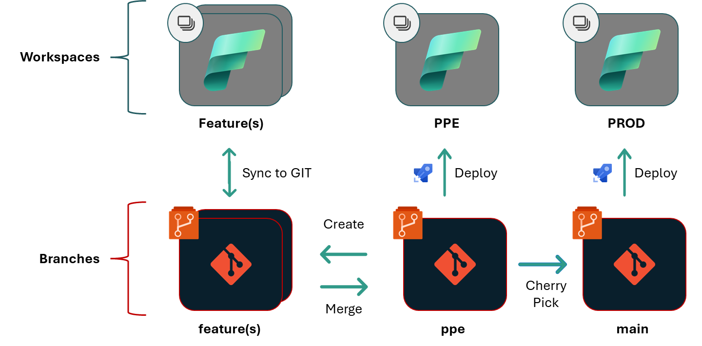

# Getting Started

## Installation

To install fabric-cicd, run:

```bash
pip install fabric-cicd
```

While in private preview, to install fabric-cicd, run:

```bash
pip install --upgrade --index-url https://test.pypi.org/simple/ --extra-index-url https://pypi.org/simple/ fabric-cicd
```

## Authentication

-   You can optionally provide your own credential object that aligns with the `TokenCredential` class. For more details, see the [TokenCredential](https://learn.microsoft.com/en-us/dotnet/api/azure.core.tokencredential) documentation.
-   If you do not provide a `token_credential` parameter, the library will use the Azure SDK's `DefaultAzureCredential` for authentication.

    -   Refer to the [Azure SDK](https://learn.microsoft.com/en-us/azure/developer/python/sdk/authentication/credential-chains?tabs=dac#defaultazurecredential-overview) documentation for the order in which credential types are attempted.
    -   For local development with a User Principal Name (UPN), install either the [Azure CLI](https://learn.microsoft.com/en-us/cli/azure/install-azure-cli-windows) or the [Az.Accounts](https://www.powershellgallery.com/packages/Az.Accounts/2.2.3) PowerShell module.

    -   Note: When no credential is provided, the `DefaultAzureCredential` may select an unexpected identity. For example, if you log in to the Azure CLI with a Service Principal Name (SPN) but log in to Az.Accounts with a UPN, the `DefaultAzureCredential` will prioritize the CLI authentication.

## Directory Structure

This library deploys from a directory containing files and directories committed via the Fabric Source Control UI. Ensure the `repository_directory` includes only these committed items, with the exception of the `parameter.yml` file.

```
/<your-directory>
    /<item-name>.<item-type>
        ...
    /<item-name>.<item-type>
        ...
    /<workspace-subfolder>
        /<item-name>.<item-type>
            ...
        /<item-name>.<item-type>
            ...
    /parameter.yml
```

## GIT Flow

The flow pictured below is the hero scenario for this library and is the recommendation if you're just starting out.

-   `Deployed` branches are not connected to workspaces via [GIT Sync](https://learn.microsoft.com/en-us/fabric/cicd/git-integration/git-get-started?tabs=azure-devops%2CAzure%2Ccommit-to-git#connect-a-workspace-to-a-git-repo)
-   `Feature` branches are connected to workspaces via [GIT Sync](https://learn.microsoft.com/en-us/fabric/cicd/git-integration/git-get-started?tabs=azure-devops%2CAzure%2Ccommit-to-git#connect-a-workspace-to-a-git-repo)
-   `Deployed` workspaces are only updated through script-based deployments, such as through the fabric-cicd library
-   `Feature` branches are created from the default branch, merged back into the default `Deployed` branch, and cherry picked into the upper `Deployed` branches
-   Each deployment is a full deployment and does not consider commit diffs


