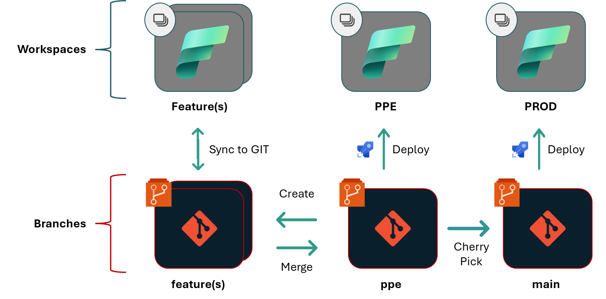

# Getting Started

## Installation

To install fabric-cicd, run:

```bash
pip install fabric-cicd
```

## Authentication

> **⚠️ NOTICE**: Due to security best practices, the **Default Credential** (`DefaultAzureCredential` fallback) and **implicit Fabric Notebook authentication** (without a `token_credential` parameter) methods are no longer supported. `token_credential` is now a required parameter.

- You must provide your own credential object that aligns with the `TokenCredential` class (from [azure.identity](https://learn.microsoft.com/en-us/python/api/azure-identity/azure.identity?view=azure-python)). For more details, see the [TokenCredential](https://learn.microsoft.com/en-us/python/api/azure-core/azure.core.credentials.tokencredential?view=azure-python) documentation.
- When running in Fabric Notebook runtime, provide an explicit credential. See Authentication examples for details.

**Recommended Authentication Methods:**

- For local development: `AzureCliCredential` or `AzurePowerShellCredential` (user authentication)
- For CI/CD pipelines: `AzureCliCredential`/`AzurePowerShellCredential` (platform authentication), `ClientSecretCredential` (service principal), or `ManagedIdentityCredential` (self-hosted agents)

**Basic Example:**

```python
from azure.identity import AzureCliCredential
from fabric_cicd import FabricWorkspace

token_credential = AzureCliCredential()

workspace = FabricWorkspace(
    workspace_id="your-workspace-id",
    environment="your-target-environment",
    repository_directory="your-repository-directory",
    item_type_in_scope=["Notebook", "DataPipeline", "Environment"],
    token_credential=token_credential,
)
```

See the [Authentication Examples](../example/authentication.md) for specific implementation patterns.

## Directory Structure

This library deploys from a directory containing files and directories committed via the Fabric Source Control UI. Ensure the `repository_directory` includes only these committed items, with the exception of the `parameter.yml` file.

```
/<your-directory>
    /<item-name>.<item-type>
        ...
    /<item-name>.<item-type>
        ...
    /<workspace-subfolder>
        /<item-name>.<item-type>
            ...
        /<item-name>.<item-type>
            ...
    /parameter.yml
```

## GIT Flow

The flow pictured below is the hero scenario for this library and is the recommendation if you're just starting out.

- `Deployed` branches are not connected to workspaces via [GIT Sync](https://learn.microsoft.com/en-us/fabric/cicd/git-integration/git-get-started?tabs=azure-devops%2CAzure%2Ccommit-to-git#connect-a-workspace-to-a-git-repo)
- `Feature` branches are connected to workspaces via [GIT Sync](https://learn.microsoft.com/en-us/fabric/cicd/git-integration/git-get-started?tabs=azure-devops%2CAzure%2Ccommit-to-git#connect-a-workspace-to-a-git-repo)
- `Deployed` workspaces are only updated through script-based deployments, such as through the fabric-cicd library
- `Feature` branches are created from the default branch, merged back into the default `Deployed` branch, and cherry picked into the upper `Deployed` branches
- Each deployment is a full deployment and does not consider commit diffs


