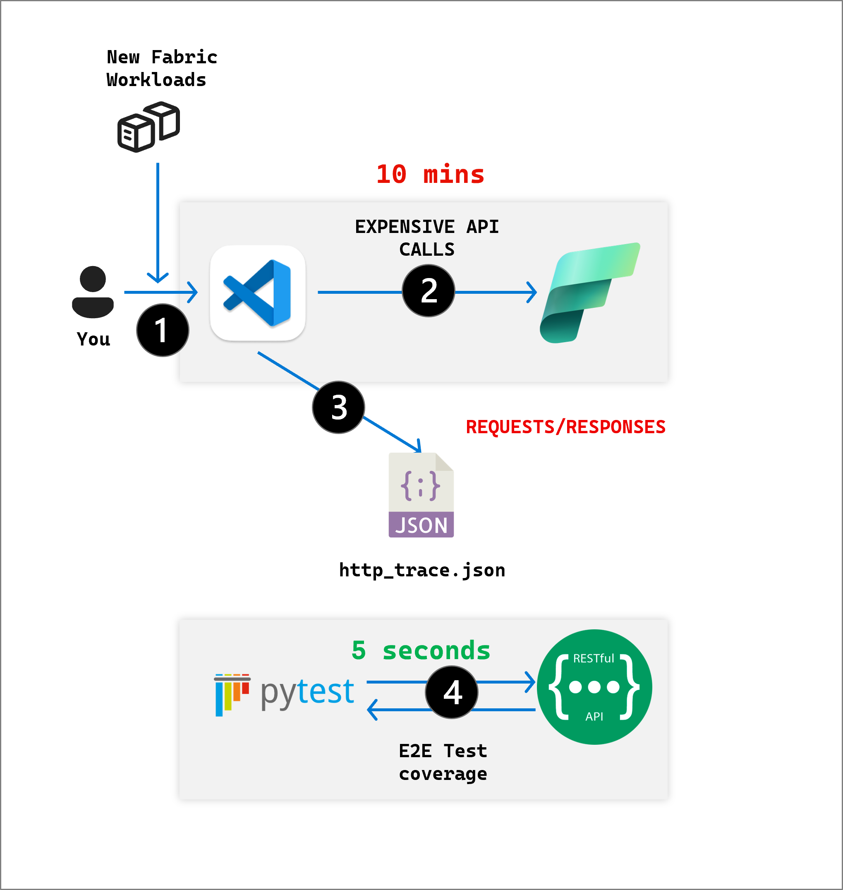

# Test Fixtures

## `mock_fabric_server`: A mock Fabric REST API

### Use Cases

Basically, this fixture allows Integration Testing without the costs associated with E2E tests.

If you peek inside `http_trace.json`, each full deployment of `fabric-cicd` project makes thousands of API calls.
As the project grows in scope, so does the amount of tests that need to be written to exercise coverage. This becomes
unruly via PyTest mocks or [monkey patching](https://docs.pytest.org/en/stable/how-to/monkeypatch.html).

In an ideal scenario, whenver a PR is opened, we'd test it against a real Fabric Workspace, but - stateful tests are 
difficult, any outages in Fabric API can cause PRs to fail - etc; this means testing against a real workspace is not
realistic.

But what if we could _mimic_ the Fabric API locally?

That's what this fixture provides.

This is a mock REST API Server that can mimic any REST API, including `https://api.powerbi.com` and `https://api.fabric.microsoft.com`. 
We can add any number of further mocks in the future as well - as long as the API calls are traced and snapshotted.

The idea is, to exercise the public facing `fabric_cicd` API E2E rapidly.
The mock server loads an `http_trace.json` file to dictate the behavior.

### Why not VCR

This is very similar to [VCR Cassettes](https://github.com/vcr/vcr). The downside of VCR is, the actual HTTP interactions are
abstracted away via the SDK, and as a result, the test code does not truly make calls to a real REST API that we have full control over.

For example, in our mock REST API, we can add logic to override exceptions at a route level, which is not possible in VCR (without opening a PR).

> In both VCR and this fixture, the one thing is common, generating snapshots takes time, since you have to interact
> with the real control plane (in this case Fabric), which is costly.
>
> The way to think about the situation is, we're able to enjoy near 100% test coverage for _all_ of our customer facing calls
> without using a real control plane, this allows us to _significantly_ increase code velocity as all code paths are tested by
> nature of a full deployment.

### What is this?

The 4 steps outlined in the image below are as follows:

1. Add new workloads into the codebase
2. Capture REST calls from Fabric using `debug_trace_deployment.py`
3. Move `http_trace.json.gz` into fixture
4. Enjoy rapid test coverage!



### Capturing HTTP Trace for new Fabric API calls

Suppose you need to add payloads for a new fabric item type or an API call.

The following script creates an HTTP snapshot that is stored in `http_trace.json.gz`, which is moved into `fabric-cicd/tests/fixtures`

Update `item_type_in_scope` in the script with the item type you want to capture HTTP traffic for, then run:

```bash
export FABRIC_WORKSPACE_ID="your-fabric-workspace-guid"
uv run python devtools/debug_trace_deployment.py
cp -f http_trace.json.gz tests/fixtures/http_trace.json.gz
```

You can validate the integration test works with the mock server with:

```bash
uv run pytest -v -s --log-cli-level=INFO tests/test_integration_publish.py::test_publish_all_items_integration
```

### Important Notes

* The `http_trace.json` must be generated in one shot, i.e. the Mock Server is not guaranteed to incrementally process new lines added to `http_trace.json`.
  What that means is - you should capture as many items as possible in `debug_trace_deployment.py`, and use that payload in the tests.

### Troubleshooting

* If a Unit Test fails on your branch but it wasn't failing on a previous branch, that means your branch contains new changes that have not
  been snapshotted. If you rever your branch to `main`, the tests should run green.
  
  Therefore, due to the logic/API call additions in your PR, you must regenerate the snapshot using the steps outlined above.

* Copilot generated PRs that change API signatures will probably need human intervention to generate snapshots, as Copilot cannot make
  REST API calls to a real Fabric instance to regenerate the snapshot. In this situation, pull the Copilot generated PR locally and rerun
  the snapshot generation.
